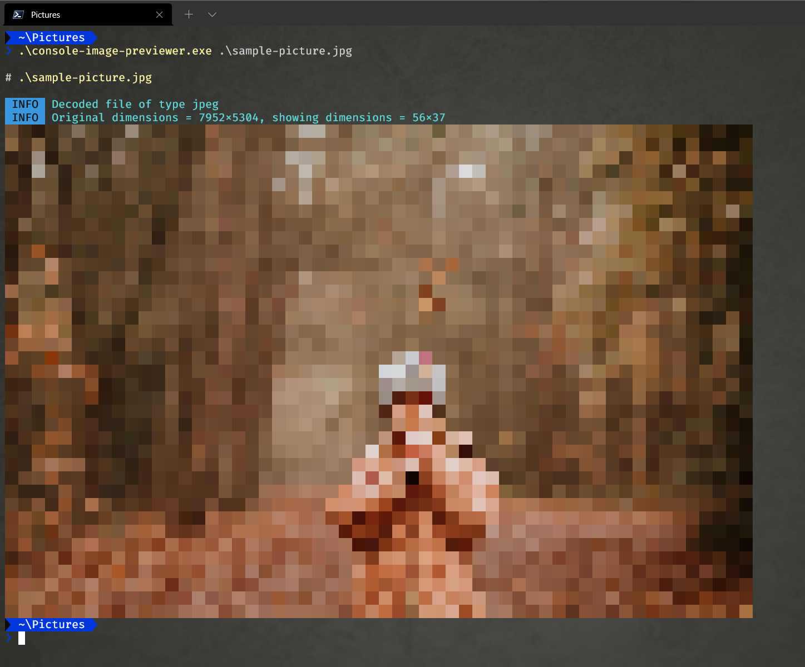

# CIV - Console Image Viewer

This command line tool scales and draws images (PNG, GIF and JPG currently) as text blocks on the console. So you can preview images without having to open a window, or e.g. over an SSH connection. 

To use it, call the executable and add one or more arguments that specify a file or wildcard. 

## State

This is a very early version, that just kind of works, but could use a lot more love. And tests.

## Dependencies

Of course, I'm standing on the shoulders of giants. These are the libraries I'm using:

* [Termenv](http://github.com/muesli/termenv) - For rendering color to the console
* [PTerm](http://github.com/pterm/pterm) - For logging and some cool standardized way of outputing state to the user.
* [Consolesize-go](http://github.com/nathan-fiscaletti/consolesize-go) - For determining the console size
* [Cobra](http://github.com/spf13/cobra) - For handling and routing command line input and arguments.
