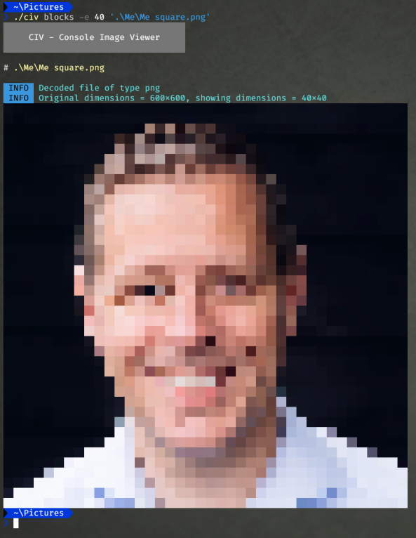
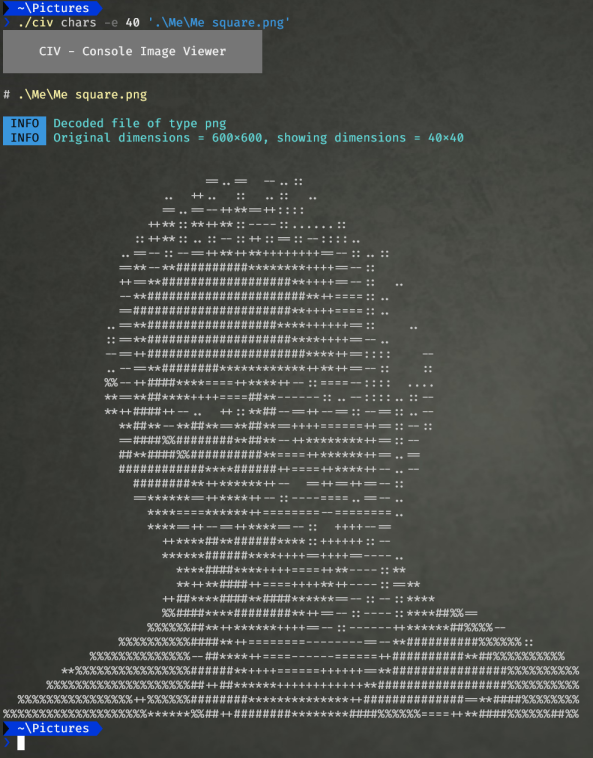

# CIV - Console Image Viewer

This command line tool scales and draws images (PNG, GIF and JPG currently) as text blocks or characters on the console. 
So you can preview images without having to open a window, or e.g. over an SSH connection. 

To use it, call the executable, add a command ('blocks', 'chars') and add one or more arguments that specify a file or wildcard. 

## Render modes

Currently 2 render modes are supported. 

### Blocks

This mode renders the picture in blocks by changing the background color of characters on the console. It looks good, but is harder to copy and use somewhere else.



To use this type (for color output) e.g.

```bash
civ blocks ./mypic.png
```

or, for mono output: 

```bash
civ blocks --mono mypic.png
```

### Chars

This mode renders the picture by printing characters that vary in 'density', simulating light and dark tones. This mode is easy to copy and looks cool. Might require some eye-squinting. 



To use this, type:

```bash
civ chars mypic.png
```

## Sizing

The program will try to detect the available width in the console you're using and scale the rendered image appropriately.
You can also override this mechanism by specifying the 'max-edge'. 
In order to do so, specify the `-e` or `--maxedge` argument, followed by an integer value. 
The value you specify will be the size of the longest edge (so the height in vertical, or 'portrait' pictures and the width in horizontal or 'landscape' pictures).

Example:
```bash
civ blocks -e 50 mypic.png
```

## State

This is a very early version, that just kind of works, but could use a lot more love. And tests.

## Dependencies

Of course, I'm standing on the shoulders of giants. These are the libraries I'm using:

* [Termenv](http://github.com/muesli/termenv) - For rendering color to the console
* [PTerm](http://github.com/pterm/pterm) - For logging and some cool standardized way of outputing state to the user.
* [Consolesize-go](http://github.com/nathan-fiscaletti/consolesize-go) - For determining the console size
* [Cobra](http://github.com/spf13/cobra) - For handling and routing command line input and arguments.
